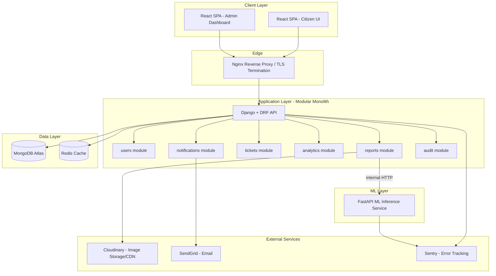
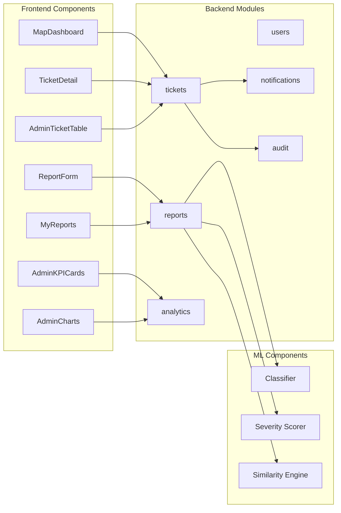
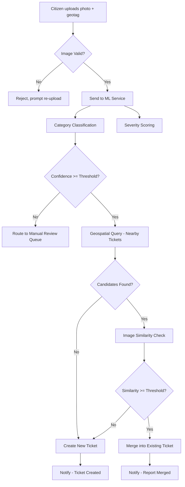
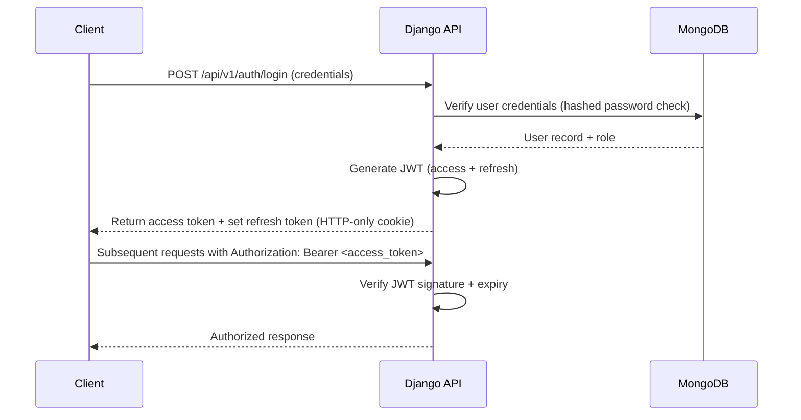
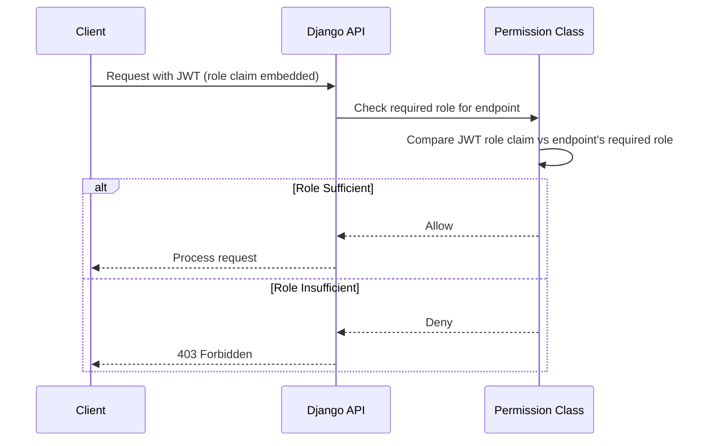
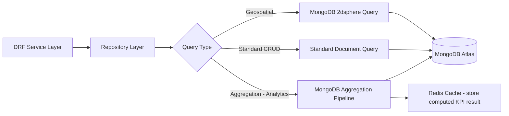
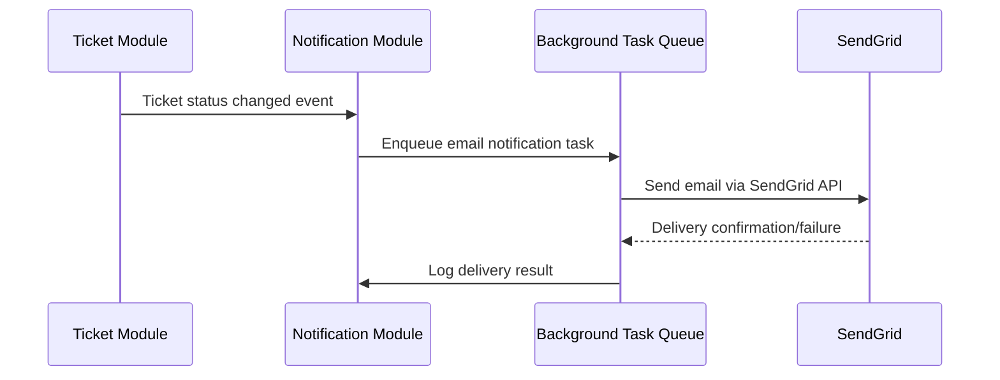
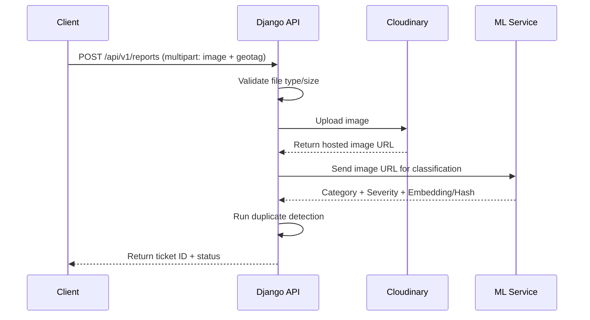
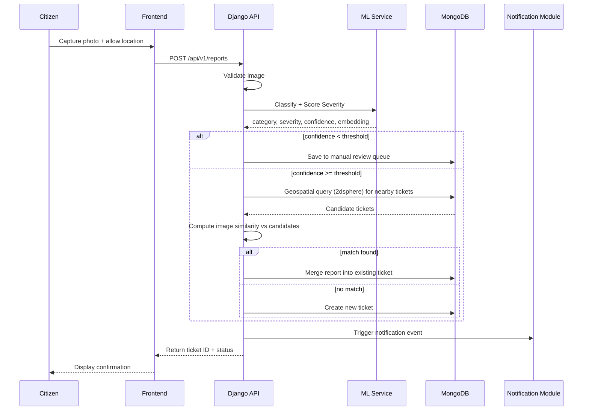
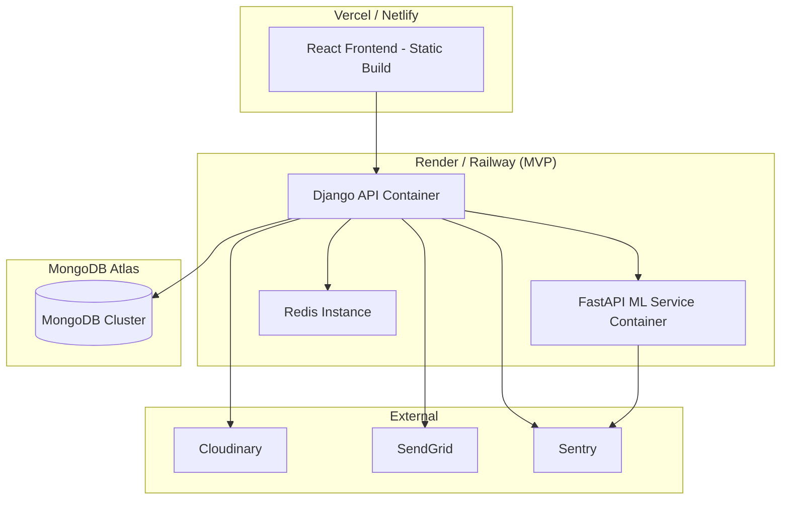

# System Architecture Document
# Civic Lens — AI-Powered Civic Issue Reporting & Transparency Platform

## Document Control

| Field | Detail |
|---|---|
| **Document Version** | 1.0 |
| **Date** | July 27, 2026 |
| **Author** | Solutions Architecture Team |
| **Status** | Draft — Pending Approval |
| **Depends On** | Document 1 (PRD v1.0), Document 2 (TDD v1.0) |

### Revision History

| Version | Date | Author | Changes |
|---|---|---|---|
| 1.0 | July 27, 2026 | Solutions Architecture Team | Initial draft, consistent with PRD/TDD v1.0 |

---

## Table of Contents

1. High-Level Architecture
2. Low-Level Architecture
3. Component Diagram
4. Data Flow Diagram
5. Request Flow
6. Authentication Flow
7. Authorization Flow
8. API Gateway Flow
9. Database Flow
10. Caching Strategy
11. Background Jobs
12. Message Queue
13. Notification Flow
14. Email Flow
15. File Upload Flow
16. Real-Time Communication
17. Microservices vs Monolith Analysis
18. Scalability Strategy
19. Disaster Recovery
20. Failure Scenarios
21. High Availability
22. Sequence Diagrams
23. Deployment Diagram
24. Infrastructure Overview
25. Cloud Architecture
26. Assumptions
27. References
28. Appendix

---

## 1. High-Level Architecture



---

## 2. Low-Level Architecture

The application layer follows a strict layered structure within each module:

```
Request → Middleware → URLConf → ViewSet (Controller) → Serializer (DTO/Validation)
        → Service Layer (business rules) → Repository Layer (mongoengine queries) → MongoDB
```

- **Controllers (DRF ViewSets)**: handle HTTP concerns only — no business logic.
- **Serializers**: validate incoming payloads, shape outgoing responses (DTO boundary).
- **Services**: contain business logic — e.g., `TicketMergeService`, `DuplicateDetectionService`, `SeverityEscalationService`.
- **Repositories**: encapsulate all `mongoengine` query logic, isolating the rest of the codebase from database-specific query syntax.

This separation ensures the database or ODM could be swapped (e.g., `mongoengine` → raw `pymongo`) with changes isolated to the repository layer only.

---

## 3. Component Diagram



---

## 4. Data Flow Diagram



---

## 5. Request Flow

1. Client sends HTTPS request to Nginx.
2. Nginx terminates TLS, forwards to Django/DRF (or FastAPI for internal ML calls).
3. Django middleware stack processes: CORS check → Authentication (JWT verification) → Logging → Rate limiting.
4. Request reaches the appropriate ViewSet, validated via Serializer.
5. Service layer executes business logic, potentially calling the ML service internally or querying MongoDB/Redis.
6. Response serialized and returned through the same middleware chain.

---

## 6. Authentication Flow



---

## 7. Authorization Flow



Sensitive admin actions (status override, bulk update) perform an additional server-side database role lookup rather than trusting the JWT claim alone, to guard against stale-token privilege scenarios (e.g., a demoted admin whose token hasn't expired yet).

---

## 8. API Gateway Flow

For MVP scale, a dedicated API Gateway product (e.g., Kong, AWS API Gateway) is not required — Nginx acts as the single entry point handling TLS termination, routing between the Django API and static frontend assets, and basic rate-limiting at the edge. This is flagged as a future scope item if the platform expands to multiple backend services requiring centralized gateway logic (auth offloading, request transformation, advanced rate limiting per API consumer).

---

## 9. Database Flow



---

## 10. Caching Strategy

| Cached Data | TTL | Reasoning |
|---|---|---|
| Admin KPI overview stats | 5 minutes | Expensive aggregation, doesn't need real-time precision |
| Category/severity breakdown charts | 5 minutes | Same as above |
| Public dashboard ticket list (per filter combination) | 60 seconds | Balances freshness against repeated aggregation load from concurrent public visitors |
| User session/role lookups | Cached per JWT lifetime | Reduces redundant DB hits on every request within token validity window |

Cache invalidation: explicit invalidation triggered on ticket status change or new ticket creation (rather than relying purely on TTL expiry) for KPI accuracy after significant events.

---

## 11. Background Jobs

The following operations are executed asynchronously via Django background task processing (Celery with Redis as broker, or Django-Q as a lighter-weight alternative for MVP scale):

1. ML classification/severity inference dispatch (avoids blocking the HTTP response during model inference).
2. Email notification dispatch on status change.
3. Scheduled recomputation of admin analytics aggregates (if not fully on-demand).
4. Periodic cleanup of stale "manual review queue" entries older than a defined threshold, flagged for admin attention.

---

## 12. Message Queue

**Recommended: Redis as a lightweight broker for Celery (or Django-Q) task queue.**

A dedicated message broker (RabbitMQ/Kafka) is not justified at MVP scale — Redis already present in the stack for caching can double as the Celery broker, avoiding additional infrastructure. This is flagged for reconsideration in the Future Scope phase (multi-city rollout) if task volume/throughput requirements grow significantly, at which point a dedicated broker would be introduced. **Revision Note placeholder**: any such change will be documented explicitly if it occurs in a later phase.

---

## 13. Notification Flow



---

## 14. Email Flow

- Trigger events: ticket status change (per PRD FR-26), account verification (future scope), password reset.
- Templates: stored as versioned HTML templates within the `notifications` module, rendered with ticket/user context before dispatch.
- Delivery: via SendGrid API, asynchronously through the background task queue (never synchronously blocking the triggering request).
- Failure handling: failed sends logged and retried up to a configured maximum attempt count before being marked as permanently failed (surfaced in admin audit view).

---

## 15. File Upload Flow



Images are never stored as binary data within MongoDB documents — only the Cloudinary-hosted URL and derived metadata (perceptual hash, embedding vector) are persisted.

---

## 16. Real-Time Communication

**MVP Decision: No WebSocket/real-time layer implemented.**

Status updates are retrieved via client-side polling (React Query background refetch interval) on the "My Reports" and ticket detail pages, sufficient for the expected update frequency (status changes occur on the order of hours/days, not seconds). A WebSocket-based real-time layer (e.g., Django Channels) is flagged as future scope if live multi-user collaborative features (e.g., live upvote counters) are prioritized later.

---

## 17. Microservices vs Monolith Analysis

| Factor | Monolith | Microservices | Modular Monolith (Selected) |
|---|---|---|---|
| Team size fit | Good | Poor (overhead exceeds team capacity) | Good |
| Operational complexity | Low | High | Low-Medium |
| ML workload isolation | Poor (coupled scaling) | Good | Good (ML extracted as its own service) |
| Development speed (MVP) | Fast | Slow | Fast |
| Future extraction path | Difficult | N/A | Straightforward (modules already logically separated) |

**Decision**: Modular Monolith for the core Django application, with the ML inference component deliberately extracted as an independent FastAPI microservice from day one — this is the one component with genuinely distinct scaling characteristics (potential GPU requirements, different load profile). All other modules (`users`, `reports`, `tickets`, `analytics`, `notifications`, `audit`) remain within the monolith but are structured with clear module boundaries to allow future extraction if warranted (e.g., `analytics` becoming its own service if multi-city reporting load grows substantially).

---

## 18. Scalability Strategy

### Horizontal Scaling
- Django application servers: stateless (JWT auth, no server-side session), can run multiple instances behind Nginx/load balancer.
- FastAPI ML service: multiple worker instances, each loading the model once at startup (Singleton pattern per TDD Section 20); scales independently based on image-upload volume.

### Vertical Scaling
- MongoDB Atlas cluster tier upgraded as data volume/query load grows (Atlas supports seamless tier upgrades without application changes).
- Redis instance sized up if cache hit-rate demands increase.

### Load Balancer
- Introduced at production scale (AWS ALB or equivalent) distributing traffic across multiple Django/FastAPI container instances; not required at MVP single-instance pilot scale but architecture is designed to support it without rework.

### CDN
- Cloudinary's built-in CDN serves all uploaded images; static frontend assets served via Vercel/Netlify's CDN.

### Rate Limiting
- DRF throttling classes applied per-endpoint: stricter limits on `/auth/login` and `/reports` (submission) endpoints to prevent brute-force and spam-report abuse.

---

## 19. Disaster Recovery

| Scenario | Recovery Approach |
|---|---|
| Database corruption/data loss | Restore from MongoDB Atlas automated daily backup |
| ML service outage | Reports automatically routed to manual review queue (graceful degradation, not full submission failure) |
| Image storage (Cloudinary) outage | Report submission retries with exponential backoff; if persistent failure, report queued locally with a "pending upload" state |
| Complete regional outage (production stage) | Multi-AZ deployment on AWS ensures failover; not applicable/required at MVP single-region pilot stage |

---

## 20. Failure Scenarios

| Failure | System Behavior |
|---|---|
| ML classification service timeout | Report queued to manual review; user sees "processing" status rather than an error |
| Duplicate-detection query timeout | Falls back to creating a new ticket rather than blocking submission (avoiding silent data loss, per PRD reliability NFR) — flagged internally for admin review as a "duplicate-check-skipped" ticket |
| Email delivery failure | Retried via background task queue; user-facing report submission is unaffected (async, non-blocking) |
| Invalid/corrupt image upload | Rejected at validation stage with a clear client-facing error message, before reaching the ML service |
| JWT expired mid-session | Silent refresh via refresh token; if refresh token also expired, user redirected to login |

---

## 21. High Availability

- **MVP Stage**: Single-instance deployment per service (Django, FastAPI, Redis) is acceptable given target scale (50–200 concurrent users); Render/Railway provide basic automatic restart on crash.
- **Production Stage**: Minimum two instances per service behind a load balancer; MongoDB Atlas replica set (standard on paid tiers) for automatic failover.

---

## 22. Sequence Diagrams

### Report Submission → Ticket Creation/Merge (End-to-End)



---

## 23. Deployment Diagram



---

## 24. Infrastructure Overview

| Component | MVP Provider | Production Scale Provider |
|---|---|---|
| Backend API | Render/Railway | AWS ECS/EKS |
| ML Inference Service | Render/Railway | AWS ECS/EKS (GPU-enabled instance if needed) |
| Frontend | Vercel/Netlify | Vercel/Netlify (or CloudFront + S3) |
| Database | MongoDB Atlas (Shared/M0-M2 tier) | MongoDB Atlas (Dedicated tier, replica set) |
| Cache/Queue Broker | Redis (managed add-on) | AWS ElastiCache |
| Image Storage | Cloudinary | Cloudinary or AWS S3 + CloudFront |

---

## 25. Cloud Architecture

For MVP, no single "cloud provider" lock-in occurs — services are distributed across best-fit managed platforms (Render/Railway, Vercel, MongoDB Atlas, Cloudinary) to minimize cost and operational overhead. At production scale, consolidation onto AWS is recommended for unified IAM, networking (VPC), and monitoring (CloudWatch), while retaining MongoDB Atlas (which itself can be deployed within AWS's network via Atlas's AWS-hosted option, reducing cross-provider latency).

---

## 26. Assumptions

1. MVP traffic levels (50–200 concurrent users) do not require a dedicated API Gateway product or multi-region deployment.
2. Redis, already required for caching, can double as the Celery/Django-Q broker at MVP scale without dedicated message queue infrastructure.
3. Real-time WebSocket communication is not required for MVP; polling-based status updates are sufficient given the expected update frequency of civic issue resolution.
4. Single-region deployment is acceptable for a single-city pilot; multi-region/multi-AZ is a production-scale future consideration.

---

## 27. References

- PRD v1.0 (Document 1)
- TDD v1.0 (Document 2)
- MongoDB Atlas architecture documentation (geospatial + replica set capabilities)

---

## 28. Appendix

**Consistency Note**: Architecture decisions here (Modular Monolith + isolated FastAPI ML service, MongoDB with `2dsphere`, JWT auth, Redis caching) are fully consistent with TDD v1.0 Sections 1–9. No contradicting architectural decision has been introduced in this document.

**Carried Forward to Subsequent Documents**:
- Full MongoDB schema detail → Database Design Document
- REST endpoint specifications reflecting this request/auth flow → API Design Document
