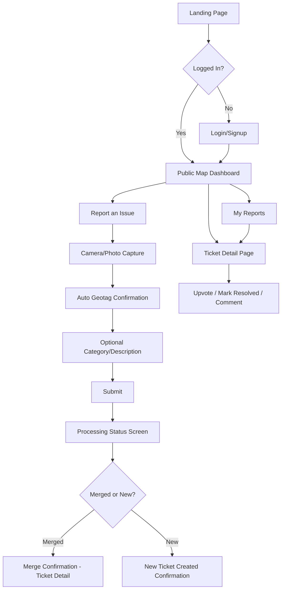
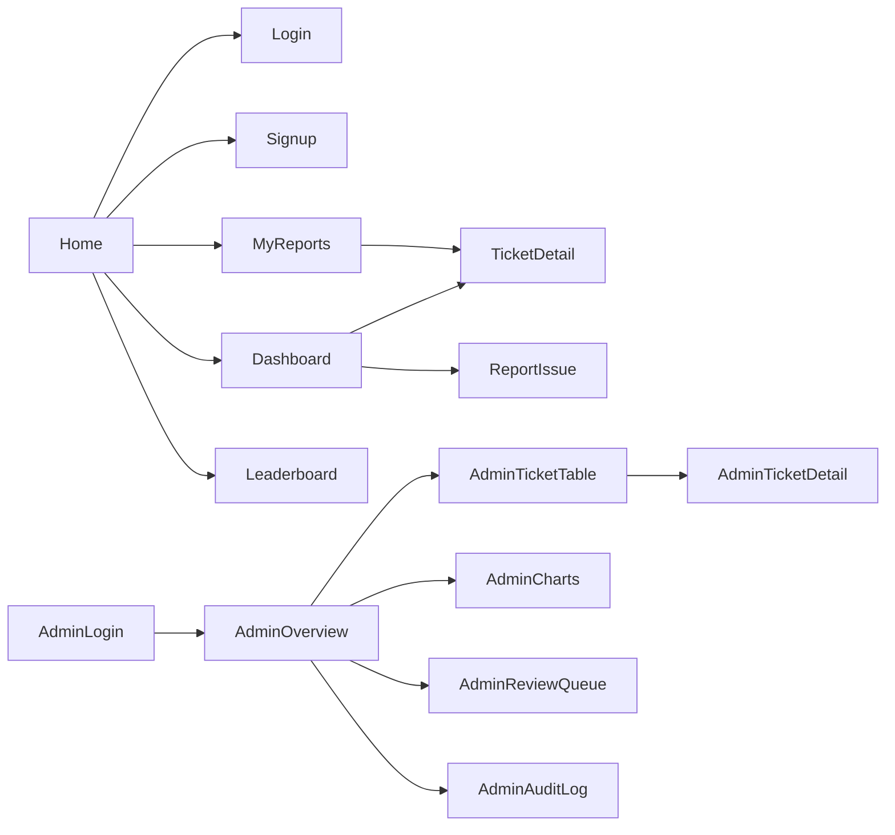

# UI/UX Design & User Flow Document
# Civic Lens — AI-Powered Civic Issue Reporting & Transparency Platform

## Document Control

| Field | Detail |
|---|---|
| **Document Version** | 1.0 |
| **Date** | July 27, 2026 |
| **Author** | Product Design Team |
| **Status** | Draft — Pending Approval |
| **Depends On** | Documents 1–5 |

### Revision History

| Version | Date | Author | Changes |
|---|---|---|---|
| 1.0 | July 27, 2026 | Product Design Team | Initial design spec, consistent with API Design Document v1.0 |

---

## Table of Contents

1. Design Philosophy
2. User Journey
3. Complete User Flow
4. Navigation Map
5. Page-by-Page Breakdown
6. Component Inventory
7. Dashboard Layout (Admin)
8. Responsive Design
9. Dark Mode
10. Accessibility (WCAG)
11. Color Palette
12. Typography
13. Spacing System
14. Icons
15. Animations
16. Loading States
17. Empty States
18. Error States
19. Success States
20. Component Reusability
21. Design Tokens
22. Assumptions
23. References
24. Appendix

---

## 1. Design Philosophy

Civic Lens's design language is guided by three principles:
1. **Trust through clarity** — since the platform's entire value proposition is transparency, the UI itself must feel transparent: visible status indicators, no hidden states, clear iconography for severity.
2. **Low-friction reporting** — the citizen reporting flow is the most frequently used path and must minimize steps, form fields, and cognitive load.
3. **Civic, not corporate** — visual tone should feel approachable and public-service-oriented rather than like a typical SaaS dashboard, using a calm, accessible color palette rather than aggressive branding.

---

## 2. User Journey

### Citizen Journey
```
Discover App → Sign Up/Login → See Public Map (builds trust/context)
   → Report an Issue (photo + auto-geotag) → See real-time processing status
   → Ticket Created/Merged confirmation → Track in "My Reports"
   → Receive status-change notification → Ticket marked Resolved
```

### Admin Journey
```
Admin Login (separate credential flow) → KPI Overview Dashboard
   → Review Ticket Management Table (sorted by severity/report count)
   → Drill into Ticket Detail → Update Status / Override Classification
   → Review Manual Review Queue → Assign correct category/severity
   → Review Analytics Charts for trend/performance reporting
```

---

## 3. Complete User Flow



---

## 4. Navigation Map



---

## 5. Page-by-Page Breakdown

### 5.1 Landing Page (`/`)
- **Purpose**: Brief explainer + call to action
- **Components**: Hero section (tagline + CTA buttons: "Report an Issue" / "View Map"), brief 3-step "How it Works" section, footer with links
- **States**: Standard only (no loading/error states needed — static content)

### 5.2 Login / Signup (`/login`, `/signup`)
- **Components**: Form (email/phone, password), "Continue with Google" button, toggle link between login/signup, inline validation error messages
- **States**: Loading (button spinner during auth request), Error (invalid credentials banner), Success (redirect to Dashboard)

### 5.3 Report an Issue (`/report`)
- **Components**: Camera capture button / file input (mobile forces camera capture per FR-6 design intent), location permission prompt + confirmation map pin preview, optional category dropdown, optional description textarea (char counter, 200 max), Submit button
- **States**:
  - Loading: "Uploading..." progress indicator, then "Analyzing photo..." step indicator
  - Error: image validation failure, location permission denied (with retry guidance)
  - Success: confirmation card showing assigned category/severity + whether merged or new ticket

### 5.4 Public Map/Heatmap Dashboard (`/dashboard`)
- **Components**: Full-screen map (Leaflet.js) with severity-colored markers/clusters, filter panel (category, severity, status, date range — collapsible on mobile), legend, marker click → popup preview → link to Ticket Detail
- **States**: Loading (map skeleton + spinner), Empty (no tickets in current viewport — friendly message, not an error), Error (map failed to load — retry button)

### 5.5 Ticket Detail Page (`/ticket/:id`)
- **Components**: Photo carousel (all submitted photos), category/severity badges, report count + upvote count, status timeline (visual stepper: reported → verified → acknowledged → in-progress → resolved), Upvote button, "Mark as Resolved" button, comment section (if feature-flag enabled)
- **States**: Loading (skeleton card), Error (ticket not found — 404 friendly page), Success (full detail rendered)

### 5.6 My Reports (`/my-reports`)
- **Components**: List/table of user's own reports with thumbnail, category, status badge, date, link to associated ticket
- **States**: Loading (skeleton rows), Empty ("You haven't reported anything yet" + CTA to report), Error (retry banner)

### 5.7 Leaderboard (`/leaderboard`) — *Should-Have*
- **Components**: Ranked list of top contributors, civic score, badges earned
- **States**: Loading, Empty (rare, if no users have contributed yet), Success

### 5.8 Admin Login (`/admin/login`)
- **Components**: Separate, distinctly styled login form (visually distinguished from citizen login to avoid confusion, per admin credential provisioning model in TDD Section 8)
- **States**: Loading, Error, Success (redirect to Admin Overview)

### 5.9 Admin Overview Dashboard (`/admin/overview`)
- **Components**: KPI cards (total tickets, unresolved count, avg. resolution time, most-reported category, most-affected zone), quick-links to Ticket Table / Review Queue / Audit Log
- **States**: Loading (KPI card skeletons), Error (partial-failure handling — individual KPI card shows error state without blocking the rest of the dashboard), Success

### 5.10 Admin Charts Page (`/admin/analytics`)
- **Components**: Category breakdown (donut chart), severity distribution (bar chart), resolution trend (line chart), area-wise density (map or bar chart), date-range filter control shared across all charts
- **States**: Loading (chart skeletons), Empty (insufficient data for a given date range), Error (chart-level error boundary, isolated per TDD Section 4)

### 5.11 Admin Ticket Management Table (`/admin/tickets`)
- **Components**: Sortable/filterable data table (severity, report count, area, status, date columns), inline status-update dropdown, row-select checkboxes + bulk action bar, override-classification modal, flag-spam action
- **States**: Loading (table skeleton), Empty (no tickets matching filter), Error (retry), Success

### 5.12 Admin Manual Review Queue (`/admin/review-queue`)
- **Components**: List of low-confidence reports awaiting manual categorization, photo preview, category/severity assignment form per item
- **States**: Loading, Empty ("Queue is clear" — positive empty state), Error, Success

### 5.13 Admin Audit Log (`/admin/audit-log`)
- **Components**: Read-only, filterable table (actor, action type, target, before/after values, timestamp)
- **States**: Loading, Empty, Error, Success

---

## 6. Component Inventory

| Component | Used On | Reusable Elsewhere |
|---|---|---|
| `SeverityBadge` | Ticket Detail, Dashboard markers, Admin Table | Yes — single source of severity color mapping |
| `StatusStepper` | Ticket Detail | No (specific to ticket lifecycle visualization) |
| `MapView` | Public Dashboard, Admin Area Density Chart | Yes, parameterized by marker set |
| `KPICard` | Admin Overview | Yes — generic card accepting label/value/trend props |
| `ChartCard` (wraps Recharts components) | Admin Analytics | Yes — generic wrapper handling loading/empty/error states uniformly |
| `DataTable` | Admin Ticket Table, Admin Audit Log | Yes — generic sortable/filterable table |
| `PhotoCarousel` | Ticket Detail | Yes — reusable if photo galleries appear elsewhere |
| `FormInput` / `FormTextarea` / `FormDropdown` | Report form, Profile, Login/Signup | Yes — base form primitives |
| `Modal` | Override classification, bulk action confirmation | Yes — generic modal shell |
| `Toast/Notification banner` | Global | Yes — used for all success/error feedback app-wide |
| `EmptyState` | My Reports, Dashboard, Review Queue | Yes — generic, parameterized by icon/message/CTA |
| `Skeleton` | All loading states | Yes — generic shimmer-loading placeholder |

---

## 7. Dashboard Layout (Admin)

```
+-------------------------------------------------------------+
| Top Nav: Logo | Overview | Tickets | Analytics | Review Q. | Audit Log | Profile |
+-------------------------------------------------------------+
| KPI Card | KPI Card | KPI Card | KPI Card | KPI Card         |
+-------------------------------------------------------------+
| Category Donut Chart   |   Severity Bar Chart                |
+-------------------------------------------------------------+
| Resolution Trend Line Chart (full width)                     |
+-------------------------------------------------------------+
| Area-wise Density (map or bar chart)                          |
+-------------------------------------------------------------+
```

On mobile, this stacks vertically in the same top-to-bottom order (KPIs → charts), with the top nav collapsing into a hamburger menu.

---

## 8. Responsive Design

| Breakpoint | Target | Layout Behavior |
|---|---|---|
| < 640px (mobile) | Citizens on the go, primary reporting use case | Single-column stacking; camera-first report flow; bottom nav bar for key actions |
| 640–1024px (tablet) | Secondary citizen use, occasional admin use | Two-column where appropriate (e.g., map + filter panel side-by-side) |
| > 1024px (desktop) | Primary admin use case | Full multi-column dashboard layout, persistent side navigation for admin |

Mobile is treated as the primary design target for citizen-facing pages (per PRD Persona 1 — commute-based reporting use case); desktop is the primary target for admin-facing pages.

---

## 9. Dark Mode

*(Assumption: Not an explicit PRD requirement; included as a reasonable modern baseline expectation.)*
- Supported via Tailwind's `dark:` variant classes, toggled by system preference (`prefers-color-scheme`) by default, with manual override toggle in profile settings.
- Severity color-coding (Section 11) is adjusted for adequate contrast in dark mode (e.g., desaturated red/amber/green variants) rather than reusing identical hex values, to preserve WCAG contrast compliance in both modes.

---

## 10. Accessibility (WCAG)

Per PRD Non-Functional Requirement (Section 14): target WCAG 2.1 AA.

| Requirement | Implementation |
|---|---|
| Color contrast | Minimum 4.5:1 for body text, 3:1 for large text/UI components; severity badges paired with icon/text label, not color alone (color-blind safe) |
| Keyboard navigation | All interactive elements (map markers, form fields, table rows, modal actions) reachable and operable via keyboard; visible focus indicators |
| Alt text | All meaningful images (report photos) have descriptive alt text (e.g., "Photo of pothole submitted by user"); decorative icons marked `aria-hidden` |
| Screen reader support | Semantic HTML landmarks (`<nav>`, `<main>`, `<header>`); ARIA labels on icon-only buttons (e.g., upvote button) |
| Form errors | Announced via `aria-live` regions, not color-only indication |

---

## 11. Color Palette

| Purpose | Color | Hex (Light Mode) |
|---|---|---|
| Primary Brand | Civic Blue | `#1E5F8C` |
| Secondary Accent | Warm Amber | `#E8A33D` |
| Severity — Low | Muted Green | `#4CAF7D` |
| Severity — Medium | Amber | `#E8A33D` |
| Severity — High | Muted Red | `#D64545` |
| Background (Light) | Off-White | `#F7F9FB` |
| Background (Dark) | Charcoal | `#1A1D21` |
| Text Primary | Near-Black | `#1F2937` |
| Text Secondary | Slate Gray | `#6B7280` |
| Success | Green | `#2F9E5B` |
| Error | Red | `#C0392B` |

*(Assumption: Exact palette is a reasonable design starting point reflecting the "civic, not corporate" philosophy in Section 1; final palette subject to stakeholder/branding review.)*

---

## 12. Typography

| Role | Font | Weight | Size (Desktop) |
|---|---|---|---|
| Headings (H1) | Inter | 700 | 32px |
| Headings (H2) | Inter | 600 | 24px |
| Headings (H3) | Inter | 600 | 20px |
| Body Text | Inter | 400 | 16px |
| Small/Caption Text | Inter | 400 | 13px |
| Buttons/Labels | Inter | 500 | 14–16px |

Inter is selected for its high legibility at small sizes (relevant for mobile-first citizen reporting flow) and broad free licensing (Google Fonts).

---

## 13. Spacing System

- Base unit: `4px`, following Tailwind's default spacing scale (`1 = 4px`, `2 = 8px`, `4 = 16px`, etc.) to keep spacing consistent and avoid arbitrary pixel values throughout the codebase.
- Card padding: `16px` (mobile) / `24px` (desktop).
- Section vertical rhythm: `32px` between major page sections.

---

## 14. Icons

- **Library**: Lucide icons (open-source, consistent stroke-based style, pairs naturally with Tailwind-based projects).
- **Category Icons**: distinct icon per issue category (pothole, waterlogging, streetlight, garbage) used consistently across map markers, ticket badges, and admin charts — reinforcing recognizability without relying on text alone.
- **Severity Icons**: paired with color per Section 11 (e.g., triangle-alert for high, circle-alert for medium, info-circle for low) to satisfy color-blind-safe accessibility requirement.

---

## 15. Animations

- **Principle**: Purposeful, minimal — animations should communicate state change, not decorate.
- Map marker clustering: smooth expand/collapse transition (200ms ease-out) when zooming.
- Status stepper: subtle progress-fill animation when a ticket's status advances.
- Toast notifications: slide-in/fade-out (250ms).
- Skeleton loaders: shimmer effect during data fetch, replacing spinner-only loading where layout shift would otherwise occur.
- No animation exceeds 300ms, in keeping with WCAG guidance on avoiding excessive motion; a "reduce motion" media query respected for users with `prefers-reduced-motion` enabled.

---

## 16. Loading States

| Context | Loading Pattern |
|---|---|
| Report submission | Multi-step progress indicator: "Uploading photo" → "Analyzing image" → "Checking for duplicates" → "Finalizing" |
| Dashboard map | Map container skeleton + centered spinner |
| Admin KPI cards | Individual card skeletons (shimmer), loading independently so a slow single metric doesn't block the rest |
| Tables (Admin Ticket Table, Audit Log) | Skeleton rows (5–8 placeholder rows matching final row height) |
| Charts | Skeleton chart-shaped placeholder, not a generic spinner, to reduce layout shift on load |

---

## 17. Empty States

| Context | Message & CTA |
|---|---|
| My Reports (no reports yet) | "You haven't reported any issues yet." + "Report an Issue" button |
| Public Dashboard (no tickets in viewport) | "No reported issues in this area right now." (framed positively, not as an error) |
| Manual Review Queue (queue clear) | "Review queue is clear — great job!" (positive reinforcement for admins) |
| Admin Analytics (no data in selected date range) | "No data available for the selected period. Try expanding your date range." |
| Comments (no comments yet) | "No comments yet. Be the first to add context." |

---

## 18. Error States

| Context | Handling |
|---|---|
| Form validation error | Inline field-level error message + red border, `aria-live` announcement |
| API request failure (retryable) | Toast notification with a "Retry" action button |
| Map failed to load | In-map error card with "Reload Map" button, rather than blank/broken map area |
| Ticket not found (404) | Dedicated friendly 404 page with link back to Dashboard |
| Chart rendering failure | Isolated error boundary per chart card — one broken chart does not take down the entire Admin Analytics page (per TDD Section 4, Error Boundaries) |
| Image upload rejected | Specific, actionable message (e.g., "Image too large — please use a photo under 8MB") rather than a generic failure message |

---

## 19. Success States

| Context | Feedback |
|---|---|
| Report submitted → new ticket created | Confirmation card: "Thanks! Your report created a new ticket." + link to Ticket Detail |
| Report submitted → merged into existing ticket | Confirmation card: "This issue was already reported — your photo has been added as supporting evidence." + link to Ticket Detail, framed to make the user feel their contribution still mattered |
| Upvote successful | Instant optimistic UI update (count increments immediately) + subtle toast confirmation |
| Admin status update | Toast: "Ticket status updated to [status]." + table row updates in place without full page reload |
| Bulk action completed | Toast summarizing outcome: "12 tickets updated, 0 failed." |

---

## 20. Component Reusability

All components in Section 6 are built as generic, prop-driven components rather than page-specific one-offs, following the design token system (Section 21) for styling — e.g., `SeverityBadge` accepts a `severity` prop and internally maps to the correct color/icon pairing rather than being re-implemented per page. This directly supports the TDD's Maintainability non-functional requirement (TDD Section 11, Folder Structure — `components/` as a shared, page-agnostic directory).

---

## 21. Design Tokens

```
--color-primary: #1E5F8C;
--color-accent: #E8A33D;
--color-severity-low: #4CAF7D;
--color-severity-medium: #E8A33D;
--color-severity-high: #D64545;
--color-bg-light: #F7F9FB;
--color-bg-dark: #1A1D21;
--color-text-primary: #1F2937;
--color-text-secondary: #6B7280;
--color-success: #2F9E5B;
--color-error: #C0392B;

--font-family-base: 'Inter', sans-serif;
--font-size-h1: 32px;
--font-size-h2: 24px;
--font-size-h3: 20px;
--font-size-body: 16px;
--font-size-caption: 13px;

--spacing-unit: 4px;
--radius-card: 8px;
--radius-button: 6px;

--animation-duration-short: 200ms;
--animation-duration-medium: 250ms;
--animation-duration-max: 300ms;
```

These tokens are implemented as Tailwind theme extensions (`tailwind.config.js`) rather than hardcoded values throughout components, ensuring a single source of truth consistent with the TDD's coding standards (Section 11).

---

## 22. Assumptions

1. Dark mode is included as a reasonable modern baseline UX expectation, not an explicit PRD requirement — flagged as a nice-to-have that can be descoped under timeline pressure without affecting core functionality.
2. Exact color palette and typography selections (Sections 11–12) are a proposed starting point; final values are subject to stakeholder/branding review before implementation.
3. Bottom navigation bar on mobile (citizen-facing) is assumed as a UX best practice for a mobile-first reporting flow, not explicitly specified in the PRD.
4. Comment section UI (Section 5.5) is built but conditionally rendered based on the feature flag defined in TDD Section 22, consistent with the Should-Have designation in the PRD.

---

## 23. References

- PRD v1.0 (Document 1) — Personas (Section 7) directly inform the mobile-first citizen flow and desktop-first admin flow design decisions.
- API Design Document v1.0 (Document 5) — every page's data requirements map to specific endpoints documented there.
- WCAG 2.1 AA guidelines.

---

## 24. Appendix

**Consistency Note**: All pages, components, and states described in this document map directly to functional requirements defined in the PRD (Document 1) and are backed by endpoints defined in the API Design Document (Document 5). No UI element requires data not already modeled in the Database Design Document (Document 4). Where a design decision was not explicitly specified in earlier documents (e.g., dark mode, bottom navigation), it is clearly flagged as an assumption in Section 22 rather than presented as a firm requirement.

**End of Document Set.** This concludes all six documents: PRD, TDD, System Architecture Document, Database Design Document, API Design Document, and UI/UX Design & User Flow Document — forming a complete, internally consistent specification suitable for a development team to begin implementation.
